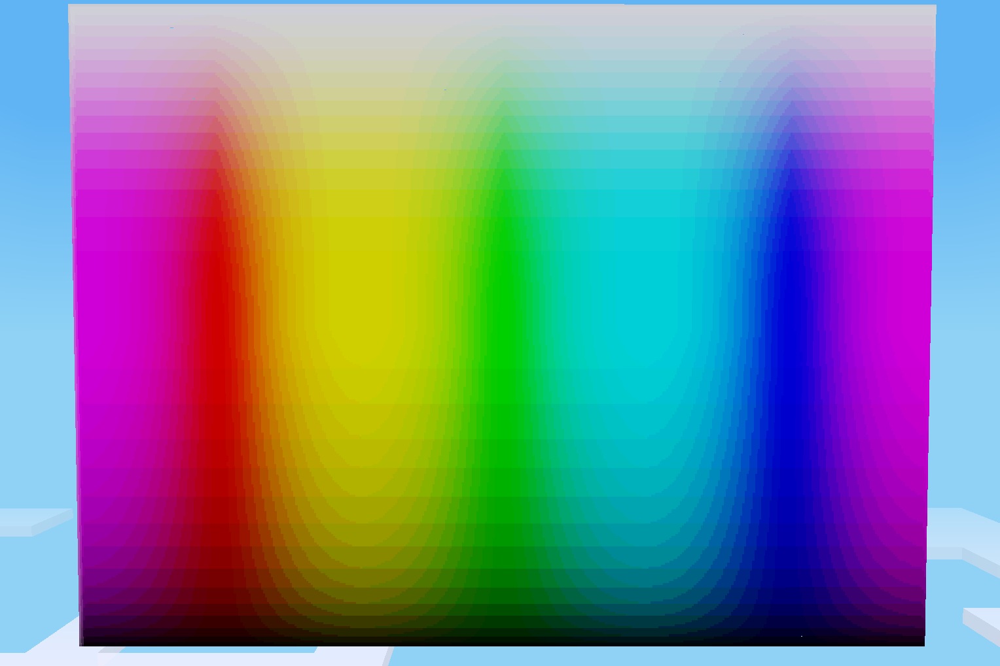

# hexcol

## 4096 Coloured blocks for minetest.

This mod contains solid colour nodes for every possible 3 digit HEX colour value. From `#000` to `#FFF`.

This mod is currently only for use with creative mode. There is no way to obtain the nodes in survival. Anyone is welcome to make a mod to provide such a method.

## Settings

* `hexcol_inv` (bool Default: true) Show hexcol nodes in creative inventory.

## Features

* LOTS of colours good for decorative builds such as pixel art.
* Small. Mod code is small.
* Ease of use with worldedit. Just do `//set fff` or whatever colour you want.

## Drawbacks

* Floods the creative inventory if hexcol_inv is true (default)
* Drastically increses player joining load times as it spends time initializing all the nodes.

## License

Code is licensed under the MIT license. Image assets are CC0. Though the block texture is just a pain white image so I dont think I could copyright it even if I wanted to lol.
